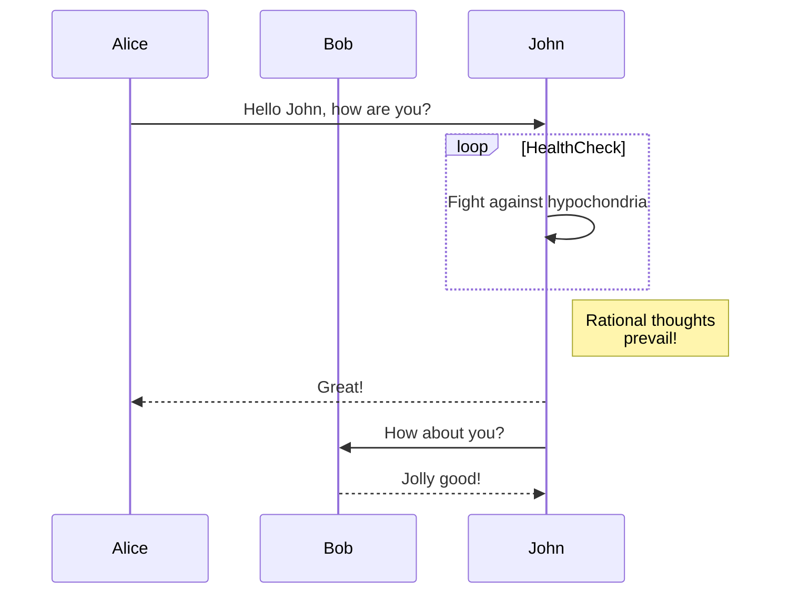
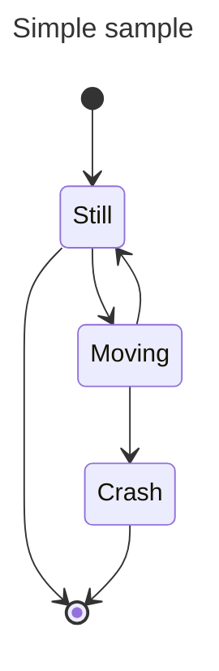
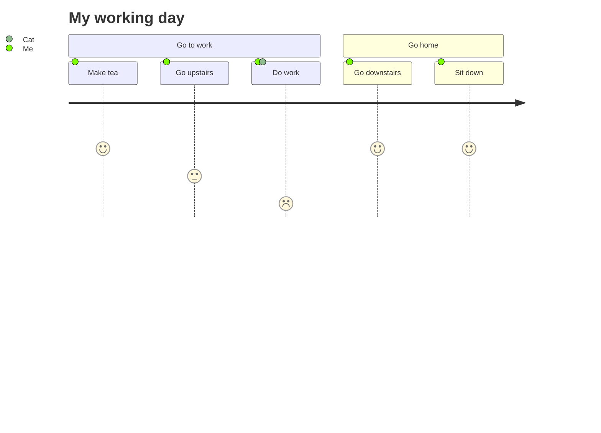
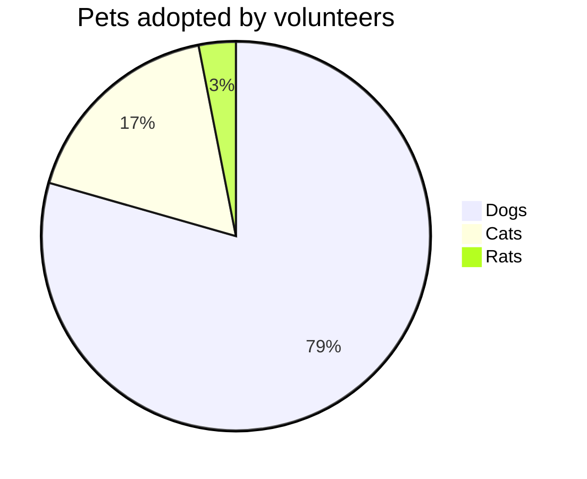

# Integration with GitHub README Files

This guide explains how to integrate Mermaid diagrams into your GitHub `README.md` files. Mermaid is a JavaScript-based diagramming and charting tool that renders Markdown-inspired text definitions to create and modify diagrams dynamically.


## How to Use Mermaid in GitHub README

To include Mermaid diagrams in your GitHub `README.md` file, follow these steps:

1. **Create a Fenced Code Block**: Use triple backticks to create a fenced code block.
2. **Specify the Language**: Indicate `mermaid` as the language for the code block.
3. **Write Mermaid Code**: Inside the fenced code block, write your Mermaid diagram code.

### Example

Here is an example of how to include a simple Mermaid diagram in your `README.md` file:

```markdown
# Example Mermaid Diagram

This is an example of a Mermaid diagram in a GitHub README file.


 
Result:


### Explanation

- `graph TD;` specifies a top-down graph.
- `A-->B;` creates a link from node A to node B.
- `A-->C;` creates a link from node A to node C.
- `B-->D;` creates a link from node B to node D.
- `C-->D;` creates a link from node C to node D.

## Sequence Diagrams

You can also create sequence diagrams using Mermaid. Here is an example:

```markdown
    
# Example Sequence Diagram

 

Result:


### State Diagrams



## Advanced examples

### User Journey Diagram



### Pie Chart


## Additional Resources

For more information on Mermaid syntax and features, visit the [Mermaid documentation](https://mermaid-js.github.io/mermaid/#/).

By following these steps, you can easily integrate dynamic and visually appealing diagrams into your GitHub `README.md` files.


resources:
- https://mermaid-js.github.io/mermaid/#/
- https://github.blog/developer-skills/github/include-diagrams-markdown-files-mermaid/
```
