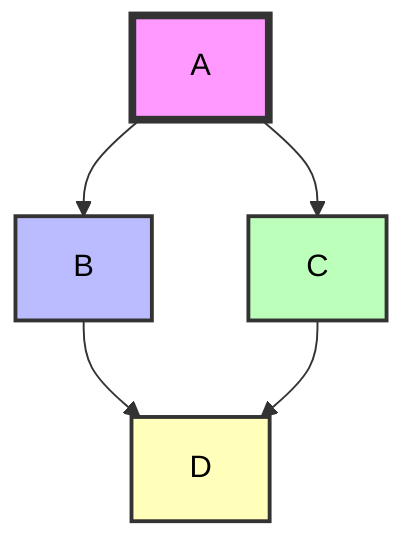
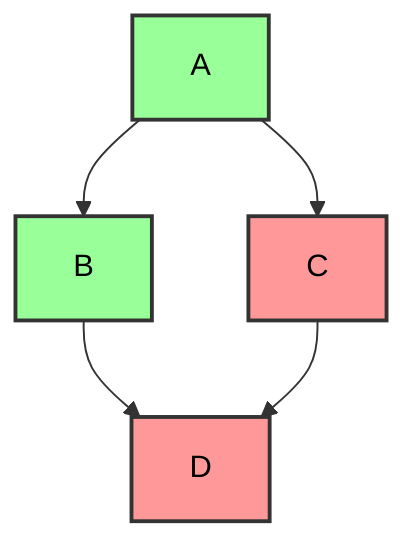

# Mermaid styles

## Change colors



```markdown
```mermaid
  style A fill:#f9f,stroke:#333,stroke-width:4px,color: black; 
    style B fill:#bbf,stroke:#333,stroke-width:2px,color: black;
    style C fill:#bfb,stroke:#333,stroke-width:2px,color: black;
    style D fill:#ffb,stroke:#333,stroke-width:2px,color: black;

```

## Define a style class


```markdown
```mermaid
    classDef green fill:#9f9,stroke:#333,stroke-width:2px,color: black;
    classDef red fill:#f99,stroke:#333,stroke-width:2px,color: black;
    class A,B green;
    class C,D red;
```


Change the style of a node


```markdown
```mermaid
    class A fill:#f9f,stroke:#333,stroke-width:4px,color: black; 
    class B fill:#bbf,stroke:#333,stroke-width:2px,color: black;
    class C fill:#bfb,stroke:#333,stroke-width:2px,color: black;
    class D fill:#ffb,stroke:#333,stroke-width:2px,color: black;
```
